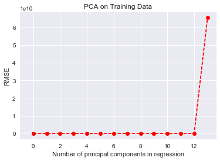
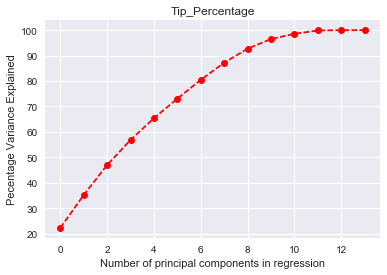
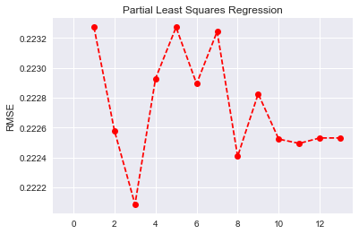

# Prediciting Gratuity using Bagging and Boosing Methods

- Cliff Green


## Introduction

- NYC Taxi and Limousine Commission (TLC) collects all trip data for Yellow, Green, and For-Hire-Vehicles (FHV). Trip data is published monthly and available on this website: http://www.nyc.gov/html/tlc/html/about/trip_record_data.shtml Since February is nearing, we would like to spend some time analyzing February of 2016 Yellow Cab trip data. In particular with Superbowl 2017 approaching, we would like to analyze trip data for Superbowl Sunday in 2016. Although, Superbowl 2016 was not in New York, we would like to see if there is an impact of a large sporting event watched by many on the taxi industry in NYC.

For this portion of the project we will try and predict whether or not a patron will leave a tip.There is obvious business use for determining what factors lead to an increase in tip frequency.
Datset Description

February 2016 Yellow Cab Data set is available for download on this website http://www.nyc.gov/html/tlc/html/about/trip_record_data.shtml. 

This dataset has over 11 million records and each record has 19 columns. The data dictionary for the dataset is available here: http://www.nyc.gov/html/tlc/downloads/pdf/data_dictionary_trip_records_yellow.pdf 

The dataset offers some intersting information in ragards to the passenger counts, trip distance, pick and dropoff locations, fare amounts, pick up and drop off times. The basic information in regards to the dataset is available below.

- VendorID - cab ID tpep_pickup_datetime.1 - Time of Pickup tpep_dropoff_datetime - Time of Dropoff passenger_count - Passenger 
- Count trip_distance - distance of Trip pickup_longitude - Pickup location pickup_latitude - Pickup location RatecodeID - Rate code given for type of trip
- dropoff_longitude - Dropoff Location
- dropoff_latitude - Dropoff Location payment_type - Type of payment fare_amount - fare extra - surcharges
- tip_amount - tip given to driver
- tolls_amount - whether or not they went on a toll road
- total_amount - total(all charges summed)
- Trip_duration - length of trip
- Average_Speed - Average speed in mph


```python
import pandas as pd
import numpy as np
from sklearn.ensemble import AdaBoostClassifier
from sklearn.ensemble import RandomForestClassifier
from sklearn.ensemble import ExtraTreesClassifier
from sklearn.tree import DecisionTreeClassifier
from sklearn.model_selection import cross_val_score
from sklearn import cross_validation
from sklearn.preprocessing import StandardScaler
from sklearn.linear_model import LogisticRegression
from sklearn import metrics as mt
from sklearn.preprocessing import scale
from sklearn.linear_model import LinearRegression
from sklearn.decomposition import PCA
from sklearn.cross_decomposition import PLSRegression, PLSSVD
from sklearn.metrics import r2_score
from sklearn.metrics import mean_squared_error
from sklearn.metrics import explained_variance_score
from sklearn.ensemble import BaggingClassifier
from sklearn.neighbors import KNeighborsClassifier
from sklearn.linear_model import SGDClassifier
import math
from math import sqrt
import statsmodels.api as sm
import seaborn as sns
import warnings
import matplotlib.pyplot as plt
warnings.filterwarnings('ignore')
%matplotlib inline
```

    C:\Users\Green\Anaconda3\lib\site-packages\sklearn\cross_validation.py:44: DeprecationWarning: This module was deprecated in version 0.18 in favor of the model_selection module into which all the refactored classes and functions are moved. Also note that the interface of the new CV iterators are different from that of this module. This module will be removed in 0.20.
      "This module will be removed in 0.20.", DeprecationWarning)
    


```python
df = pd.read_csv("Superbowl.csv")# this is the already cleaned dataset from the Superbowl Exploratory Data Analysis
```


```python
df['trip_distance'] = df['trip_distance'].apply(np.log) 
df['fare_amount'] = df['fare_amount'].apply(np.log) 
df['tip_amount'] = (df['tip_amount']+1).apply(np.log) 
df['total_amount'] = df['total_amount'].apply(np.log) 

df.drop(['tpep_dropoff_datetime','tpep_pickup_datetime','tpep_pickup_datetime.1' ], axis = 1, inplace = True, errors = 'ignore')
```


```python
df.drop(['total_amount'], axis = 1, inplace = True, errors = 'ignore')# this cause the model to overfit so it was removed
```


```python
Y = df['tip_amount']
Y_bool = df['tip_amount'].astype(bool)
X = df.drop(['tip_amount'], axis = 1, inplace = True, errors = 'ignore') 
X = df.columns.values.tolist()
X = df[X]
```


```python
X_train, X_test , y_train, y_test = cross_validation.train_test_split(X, Y_bool, test_size=0.2, random_state=1)
```


```python
scl_obj = StandardScaler()
scl_obj.fit(X_train) 

X_train = scl_obj.transform(X_train) # apply to training
X_test = scl_obj.transform(X_test)
```

# Model 1: Predicting Tip Occurrence 


```python
dt_stump = DecisionTreeClassifier(max_depth=10, criterion='gini',
            max_features=None, min_samples_leaf=1, min_samples_split=2, random_state=None,
            splitter='best')
```


```python
logicR = LogisticRegression(C=30.0, class_weight='balanced', dual=False,
          fit_intercept=True, intercept_scaling=1, max_iter=100,
          multi_class='ovr', n_jobs=1, penalty='l2', random_state=None,
          solver='liblinear', tol=0.0001, verbose=0, warm_start=False)
```

### Boosting

##### Boosting - decision trees base estimator

Here we will try boosting using a base estimator of decision trees, we also set the number of estimators as 100. We kept the cross validation folding low because, it didn’t seem as necessary to use something like 10-fold CV. We trying tuning the learning rate, starting at .01 and going to .5 in increments, there were small changes but nothing significant, the mean score was consistently between .96-.97. We also incrementally increased the Max depth starting at five to see if that improved model performance, at 10 trees we got up to .9755, and then did not change much at a max depth of 15, so I decided to keep the depth at 10.


```python
Adaboo = AdaBoostClassifier(base_estimator=dt_stump, n_estimators=100, learning_rate= .1 ).fit(X_train, y_train)
```


```python
score = cross_validation.cross_val_score(Adaboo, X_train, y_train, scoring='accuracy', cv=3)
```


```python
score.mean()
```


    0.97555362360453446


```python
Adaboo.fit(X_train, y_train)
pred = Adaboo.predict(X_test)
print(metrics.classification_report(y_test, pred))
```

                 precision    recall  f1-score   support
    
          False       1.00      0.93      0.96     23408
           True       0.96      1.00      0.98     43289
    
    avg / total       0.98      0.98      0.98     66697
    
    

##### Boosting - logistic regression as base estimator

- Here I used the same parameters that we explored during the last SVM-SGD lab, so in a way I already expected this logistic model to perform well. That being said, I did mess with the learning rate starting low(.01) and increasing(.5), the learning rate didn’t have much of an effect on the model performance. 


```python
Adaboo = AdaBoostClassifier(base_estimator=logicR, n_estimators=100, learning_rate= .05).fit(X_train, y_train)
score = cross_validation.cross_val_score(Adaboo, X_train, y_train, scoring='accuracy', cv=3)
score.mean()
```


    0.97585348711044817


```python
Adaboo.fit(X_train, y_train)
pred = Adaboo.predict(X_test)
print(metrics.classification_report(y_test, pred))
```

                 precision    recall  f1-score   support
    
          False       1.00      0.93      0.96     23408
           True       0.96      1.00      0.98     43289
    
    avg / total       0.98      0.98      0.98     66697
    
    

##### Boosting - Ridge classifier as base estimator

- Here I didn’t mess with the ridge classifier at all, out of the box it preformed really well.


```python
from sklearn.linear_model import RidgeClassifier
ridge = RidgeClassifier()
```


```python
Adaboo = AdaBoostClassifier(base_estimator=ridge, n_estimators=10, algorithm='SAMME').fit(X_train, y_train)
score = cross_validation.cross_val_score(Adaboo, X_train, y_train, scoring='accuracy', cv=3)
score.mean()
```


    0.97584973901261918


```python
Adaboo.fit(X_train, y_train)
pred = Adaboo.predict(X_test)
print(metrics.classification_report(y_test, pred))
```

                 precision    recall  f1-score   support
    
          False       1.00      0.93      0.96     23408
           True       0.96      1.00      0.98     43289
    
    avg / total       0.98      0.98      0.98     66697
    
    


```python
print(mt.confusion_matrix(y_test,pred))
print(mt.accuracy_score(y_test,pred))
```

    [[21776  1632]
     [    2 43287]]
    0.975501146978
    


```python
weights = Adaboo.estimator_weights_
var_names = X.columns
for weight, name in zip(weights, var_names):
    print(name ,'has weight of:', weight)
```

    VendorID has weight of: 3.69901340435
    passenger_count has weight of: 0.701388636245
    trip_distance has weight of: 0.590400115237
    pickup_longitude has weight of: 0.205451236965
    pickup_latitude has weight of: 0.39309734851
    RatecodeID has weight of: 0.294453615762
    dropoff_longitude has weight of: 0.277187789118
    dropoff_latitude has weight of: 0.178165390212
    payment_type has weight of: 0.192469545496
    fare_amount has weight of: 0.122328960898
    

##### Boosting - SGD as base estimator

- Initially the SGD method was giving me a accuracy score of .6 and I realized it was because I didn’t scale the variables, after scaling the accuracy score and the confusion matrix preformed much better.


```python
from sklearn.linear_model import SGDClassifier
sgd = SGDClassifier(alpha=.1,
        fit_intercept=True, l1_ratio=0.0, learning_rate='optimal',
        loss='hinge', n_iter=iterations, n_jobs=-1, penalty='l2')
```


```python
Adaboo = AdaBoostClassifier(base_estimator=sgd, n_estimators=100, algorithm='SAMME').fit(X_train, y_train)
score = cross_validation.cross_val_score(Adaboo, X_train, y_train, scoring='accuracy', cv=3)
score.mean()
```


    0.9708606900133625


```python
Adaboo.fit(X_train, y_train)
pred = Adaboo.predict(X_test)
print(metrics.classification_report(y_test, pred))
```

                 precision    recall  f1-score   support
    
          False       1.00      0.93      0.96     23408
           True       0.96      1.00      0.98     43289
    
    avg / total       0.98      0.98      0.98     66697
    
    


```python
print(mt.confusion_matrix(y_test,pred))
print(mt.accuracy_score(y_test,pred))
```

    [[21778  1630]
     [   15 43274]]
    0.975336222019
    


```python
weights = Adaboo.estimator_weights_
var_names = X.columns
for weight, name in zip(weights, var_names):
    print(name ,'has weight of:', weight)
```

    VendorID has weight of: 0.607440403701
    passenger_count has weight of: 3.33769031694
    trip_distance has weight of: 1.04508252413
    pickup_longitude has weight of: 0.00236604609336
    pickup_latitude has weight of: 0.640123250879
    RatecodeID has weight of: 0.242626304423
    dropoff_longitude has weight of: 0.0
    dropoff_latitude has weight of: 0.0
    payment_type has weight of: 0.0
    fare_amount has weight of: 0.0
    extra has weight of: 0.0
    tolls_amount has weight of: 0.0
    Trip_duration has weight of: 0.0
    Average_Speed has weight of: 0.0
    

#### Conclusion
- All of the methods worked pretty well. I also tried Gaussian and Bernoulli but they were accurate about 60% of the time. I stuck with the accuracy and the confusion matric because I don’t have a significant class imbalance problem. So for this class I think that accuracy makes sense. If I had a significant class imbalance problem I would probably use something like ROC area under the curve to score performance. Looking at some of the weights, it doesn’t really make sense to me that the vendor ID for the ridge classifier has a such a significant impact on the model. Passenger count for the SGD model does make some sense though. Also if I wanted to simplify my SGD model, it looks like there are many variables that have weights that are less than .05, meaning they can probably be removed from the model. 

### Bagging

- For the bagging method again I reduced the amount of cross validation because using something like 10 fold cross validation created a strain on my computer, it also didn’t seem super necessary. In this case, since we are bootstrap sampling with replacement, it doesnt really seem like k-fold cross validation is necessary.

##### Bagging -  Decision trees as base estimator


```python
Bag = BaggingClassifier(base_estimator=dt_stump, n_estimators=100).fit(X_train, y_train)
score = cross_validation.cross_val_score(Bag, X_train, y_train, scoring='accuracy', cv=2)
score.mean()
```


    0.97587972750573737


```python
Bag.fit(X_train, y_train)
pred = Bag.predict(X_test)
print(metrics.classification_report(y_test, pred))
```

                 precision    recall  f1-score   support
    
          False       1.00      0.93      0.96     23408
           True       0.96      1.00      0.98     43289
    
    avg / total       0.98      0.98      0.98     66697
    
    

##### Bagging - logistic regression as base estimator

-	Again here I am using the same parameters that were established during the last lab, so the logistic regression model is already optomized


```python
Bag = BaggingClassifier(base_estimator=logicR, n_estimators=100)
score = cross_validation.cross_val_score(Bag, X_train, y_train, scoring='accuracy', cv=2)
score.mean()
```


    0.9758272510773246


```python
Bag.fit(X_train, y_train)
pred = Bag.predict(X_test)
print(metrics.classification_report(y_test, pred))
```

                 precision    recall  f1-score   support
    
          False       1.00      0.93      0.96     23408
           True       0.96      1.00      0.98     43289
    
    avg / total       0.98      0.98      0.98     66697
    
    

##### Bagging - KNN as base estimator


```python

```


```python
Bag = BaggingClassifier(base_estimator=KNeighborsClassifier(), n_estimators=10)
score = cross_validation.cross_val_score(Bag, X_train, y_train, scoring='accuracy', cv=2)
score.mean()
```


    0.97291107930876408


```python
Bag.fit(X_train, y_train)
pred = Bag.predict(X_test)
print(metrics.classification_report(y_test, pred))
```

                 precision    recall  f1-score   support
    
          False       1.00      0.93      0.96     23408
           True       0.96      1.00      0.98     43289
    
    avg / total       0.97      0.97      0.97     66697
    
    

#### Conclusion
- The bagging estimators preformed about the same as the boosting methods. In terms of accuracy both methods preformed very similarly. I was running into some memory errors using the bagging method with 10 fold cross validation so I had to switch to 2 fold. Both the KNN and the Decision tree methods worked as well as the boosting methods with an accuracy of about .97


### Grid Search Method
- Here I am using a grid search method to find the optimal parameters for KNN, random forest, and logistic regression. The method incrementally increase the paraments to find the model that best fits the dataset. This is a very cool implementation but using this method on a dataset this size has been less than ideal,this took a couple hours to run, and i had to make the parameters tested small(only 1-3 KNN etc.) A lot of this code I found online [here](http://rasbt.github.io/mlxtend/user_guide/classifier/StackingClassifier/), but I change the parameters so that I could run it without getting a memory error.


```python
from mlxtend.classifier import StackingClassifier
from sklearn.model_selection import GridSearchCV

from sklearn.naive_bayes import GaussianNB 

clf1 = KNeighborsClassifier(n_neighbors=1)
clf2 = RandomForestClassifier(random_state=1)
clf3 = GaussianNB()
lr = LogisticRegression()
sclf = StackingClassifier(classifiers=[clf1, clf2, clf3], 
                          meta_classifier=lr)

params = {'kneighborsclassifier__n_neighbors': [1, 3],
          'randomforestclassifier__n_estimators': [10, 50],
          'meta-logisticregression__C': [0.1, 1.0]}

grid = GridSearchCV(estimator=sclf, 
                    param_grid=params, 
                    cv=2,
                    refit=True)
grid.fit(X_train, y_train)

cv_keys = ('mean_test_score', 'std_test_score', 'params')

for r, _ in enumerate(grid.cv_results_['mean_test_score']):
    print("%0.3f +/- %0.2f %r"
          % (grid.cv_results_[cv_keys[0]][r],
             grid.cv_results_[cv_keys[1]][r] / 2.0,
             grid.cv_results_[cv_keys[2]][r]))

print('Best parameters: %s' % grid.best_params_)
print('Accuracy: %.2f' % grid.best_score_)
```

    0.956 +/- 0.00 {'kneighborsclassifier__n_neighbors': 1, 'meta-logisticregression__C': 0.1, 'randomforestclassifier__n_estimators': 10}
    0.976 +/- 0.00 {'kneighborsclassifier__n_neighbors': 1, 'meta-logisticregression__C': 0.1, 'randomforestclassifier__n_estimators': 50}
    0.956 +/- 0.00 {'kneighborsclassifier__n_neighbors': 1, 'meta-logisticregression__C': 1.0, 'randomforestclassifier__n_estimators': 10}
    0.956 +/- 0.00 {'kneighborsclassifier__n_neighbors': 1, 'meta-logisticregression__C': 1.0, 'randomforestclassifier__n_estimators': 50}
    0.975 +/- 0.00 {'kneighborsclassifier__n_neighbors': 3, 'meta-logisticregression__C': 0.1, 'randomforestclassifier__n_estimators': 10}
    0.976 +/- 0.00 {'kneighborsclassifier__n_neighbors': 3, 'meta-logisticregression__C': 0.1, 'randomforestclassifier__n_estimators': 50}
    0.975 +/- 0.00 {'kneighborsclassifier__n_neighbors': 3, 'meta-logisticregression__C': 1.0, 'randomforestclassifier__n_estimators': 10}
    0.976 +/- 0.00 {'kneighborsclassifier__n_neighbors': 3, 'meta-logisticregression__C': 1.0, 'randomforestclassifier__n_estimators': 50}
    Best parameters: {'kneighborsclassifier__n_neighbors': 3, 'meta-logisticregression__C': 0.1, 'randomforestclassifier__n_estimators': 50}
    Accuracy: 0.98
    

- very cool, the +/- is 0 because the cv is onle 2

# Model 2: Predicting Tip Amount Given Tip 

#### PCA Regression
- For part two we are trying to predict how much tip is given, first we filtered the dataset by specifying that tip value had to be greater than zero. Just like the previous analysis the data was then split up in the same fashion using cross val. Next I used PCA to reduce dimensionality of the model. Looking at the variance explained and the RMSE graphs, it seems like I can cut the model at 12 principle components. I then fit the model using those 12 components and calculated the RMSE and R^2.


```python
Lreg = LinearRegression(copy_X=True, fit_intercept=True, n_jobs=1, normalize=False)
```


```python
df_tip = df.loc[df['tip_amount'] > 0]
```


```python
Y_tip = df_tip['tip_amount']
X_tip = df_tip.drop(['tip_amount'], axis = 1, inplace = True, errors = 'ignore') 
X_tip = df_tip.columns.values.tolist()
X_tip = df_tip[X_tip]
```

    C:\Users\Green\Anaconda3\lib\site-packages\ipykernel\__main__.py:2: SettingWithCopyWarning: 
    A value is trying to be set on a copy of a slice from a DataFrame
    
    See the caveats in the documentation: http://pandas.pydata.org/pandas-docs/stable/indexing.html#indexing-view-versus-copy
      from ipykernel import kernelapp as app
    


```python
df_tip.head()
```


<div>
<table border="1" class="dataframe">
  <thead>
    <tr style="text-align: right;">
      <th></th>
      <th>VendorID</th>
      <th>passenger_count</th>
      <th>trip_distance</th>
      <th>pickup_longitude</th>
      <th>pickup_latitude</th>
      <th>RatecodeID</th>
      <th>dropoff_longitude</th>
      <th>dropoff_latitude</th>
      <th>payment_type</th>
      <th>fare_amount</th>
      <th>extra</th>
      <th>tolls_amount</th>
      <th>Trip_duration</th>
      <th>Average_Speed</th>
    </tr>
  </thead>
  <tbody>
    <tr>
      <th>1</th>
      <td>2</td>
      <td>5</td>
      <td>-0.415515</td>
      <td>-74.002708</td>
      <td>40.718124</td>
      <td>1</td>
      <td>-74.009361</td>
      <td>40.710178</td>
      <td>1</td>
      <td>1.609438</td>
      <td>0.0</td>
      <td>0.0</td>
      <td>4.750000</td>
      <td>8.336842</td>
    </tr>
    <tr>
      <th>5</th>
      <td>1</td>
      <td>1</td>
      <td>1.757858</td>
      <td>-73.971443</td>
      <td>40.748653</td>
      <td>1</td>
      <td>-74.015968</td>
      <td>40.705009</td>
      <td>1</td>
      <td>2.944439</td>
      <td>0.0</td>
      <td>0.0</td>
      <td>16.916667</td>
      <td>20.571429</td>
    </tr>
    <tr>
      <th>6</th>
      <td>1</td>
      <td>1</td>
      <td>1.504077</td>
      <td>-73.925400</td>
      <td>40.772831</td>
      <td>1</td>
      <td>-73.977020</td>
      <td>40.766094</td>
      <td>1</td>
      <td>2.917771</td>
      <td>0.0</td>
      <td>0.0</td>
      <td>23.866667</td>
      <td>11.312849</td>
    </tr>
    <tr>
      <th>9</th>
      <td>2</td>
      <td>2</td>
      <td>0.524729</td>
      <td>-73.976601</td>
      <td>40.743874</td>
      <td>1</td>
      <td>-73.977676</td>
      <td>40.725628</td>
      <td>1</td>
      <td>2.014903</td>
      <td>0.0</td>
      <td>0.0</td>
      <td>7.316667</td>
      <td>13.858770</td>
    </tr>
    <tr>
      <th>12</th>
      <td>1</td>
      <td>1</td>
      <td>1.029619</td>
      <td>-73.966827</td>
      <td>40.772648</td>
      <td>1</td>
      <td>-73.981155</td>
      <td>40.744839</td>
      <td>1</td>
      <td>2.674149</td>
      <td>0.0</td>
      <td>0.0</td>
      <td>19.900000</td>
      <td>8.442211</td>
    </tr>
  </tbody>
</table>
</div>


```python
pca = PCA(n_components= 14)
X_train, X_test , y_train, y_test = cross_validation.train_test_split(X_tip, Y_tip, test_size=0.2, random_state=1)
# Scale the data
X_reduced_train = pca.fit_transform(scale(X_train))
n = len(X_reduced_train)


kf_10 = cross_validation.KFold(n, n_folds=10, shuffle=True, random_state=1)
rmse = []


rscore = -1*cross_validation.cross_val_score(Lreg, np.ones((n,1)), y_train.ravel(), cv=kf_10, scoring='mean_squared_error').mean()
rscore = math.sqrt(rscore)
rmse.append(rscore)


for i in np.arange(1, 14):
    rscore = -1*cross_validation.cross_val_score(Lreg, X_reduced_train[:,:i], y_train.ravel(), cv=kf_10, scoring='mean_squared_error').mean()
    rscore = math.sqrt(rscore)
    rmse.append(rscore)
plt.plot(np.array(rmse), marker='o', linestyle='--', color='r')
plt.xlabel('Number of principal components in regression')
plt.ylabel('RMSE')
plt.title('PCA on Training Data')
plt.xlim(xmin=-1);
```





```python
Var_explained = np.cumsum(np.round(pca.explained_variance_ratio_, decimals=4)*100)
```


```python
plt.plot(Var_explained, marker='o', linestyle='--', color='r')
plt.xlabel('Number of principal components in regression')
plt.ylabel('Pecentage Variance Explained')
plt.title('Tip_Percentage')
```


    <matplotlib.text.Text at 0x1d999570>





```python
X_reduced_test = pca.transform(scale(X_test))[:,:12]
regr = LinearRegression()
regr.fit(X_reduced_train[:,:12], y_train)
pred = regr.predict(X_reduced_test)
```


```python
math.sqrt(mean_squared_error(y_test, pred))
```


    0.22303315549248412


```python
r2_score(y_test, pred)
```


    0.52873806698915438


- The model fit ok, getting an r2 of .52 can be relatively good. I mean it not as great as a predictor as whether or not somebody will tip but it still is a decent predictor.


#### PLS Regression

- The other model I tried out for predicting capability was partial least squares regression, in my experience partial least squares preforms a bit better than PCA-R. For this problem, PLS-R preformed about the same as PCA-R except I was able to achieve a better(very slightly) R2 using 3 components
 


```python
n = len(X_train)
# 10-fold CV, with shuffle
kf_10 = cross_validation.KFold(n, n_folds=10, shuffle=True, random_state=1)
mse = []
for i in np.arange(1, 14):
    pls = PLSRegression(n_components=i)
    score = cross_validation.cross_val_score(pls, scale(X_train), y_train, cv=kf_10, scoring='mean_squared_error').mean()
    score = math.sqrt(-score)
    mse.append(score)
# Plot results
plt.plot(np.arange(1, 14), np.array(mse), marker='o', linestyle='--', color='r')
plt.ylabel('RMSE')
plt.title('Partial Least Squares Regression')
plt.xlim(xmin=-1)
```


    (-1, 13.6)





```python
pls = PLSRegression(n_components=3)
pls.fit(scale(X_train), y_train)
mean_squared_error(y_test, pls.predict(scale(X_test)))
```


    0.049717684717239079


```python
r2_score(y_test,pls.predict(scale(X_test)))
```


    0.52898536811842511


#### Conclusion
 
- The grid search method is a pretty cool implementation that does some of the heavy lifting in terms of parameter tuning, I guess it only works with smaller datasets because of memory requirements on jupyter notebooks. Next time I have a smaller dataset I will definitely look into that more. I also want to look further into stacking, seems like another interesting iterative model creation method.


```python

```
